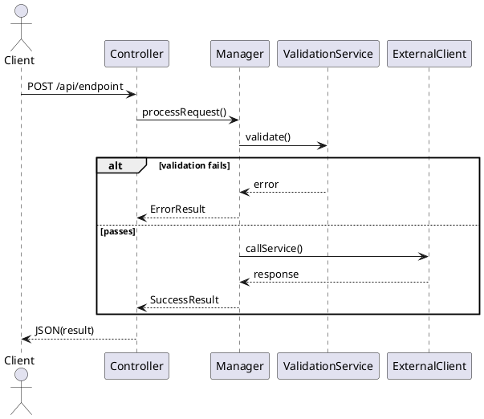

# Java Flow Extraction & Diagram Generation

## When to use this skill

Use when tracing Java code flows, generating sequence diagrams, creating state machines, documenting system architecture, or visualizing any Java application's behavior.

## Output per flow

1. **Sequence Diagram** (PlantUML/Mermaid) — main path + key alternate branches
2. **State Machine** (PlantUML/Mermaid) — enum/session lifecycle transitions
3. **Condition → Result Table** — trigger condition, source method, side effects
4. **External Integration Table** — clients, purposes, call order
5. **Session/Context Mutation List** — fields set/cleared and triggers
6. **Exception Table** — exception type, origin, propagation path

## Extraction workflow

Copy this checklist and track progress:

```
Flow Extraction Progress:
- [ ] Step 1: Identify entry point
- [ ] Step 2: Trace invocation chain
- [ ] Step 3: Extract per-flow data
- [ ] Step 4: Build diagrams
- [ ] Step 5: Quality gates verification
```

**Step 1: Identify entry point**
```bash
rg "@RestController" -tjava
rg "ControllerName" -tjava
```

**Step 2: Trace invocation chain**
Follow: Controller → Manager/Service → External Clients

**Step 3: Extract per flow**
- [ ] Controller method name + parameters
- [ ] Manager/service method chain
- [ ] Enum values as final results
- [ ] Boolean/null/size conditions that branch the flow
- [ ] Session/context fields mutated
- [ ] External clients called (order + purpose)
- [ ] Exceptions + error codes

**Step 4: Build diagrams**
Draft main path first, then add alternate branches.

Sequence diagram template:


Condition → Result table template:
| Enum Result | Trigger Condition | Source Method | Session Side Effect | External Call After |
|-------------|------------------|---------------|---------------------|---------------------|
| RESULT_A | condition == true | checkMethod() | session.field=value | Service.call |

**Step 5: Quality gates** — verify before marking final:
- [ ] Every enum value has a mapping condition
- [ ] Every external client appears in both sequence and integration table
- [ ] State machine has no dead states
- [ ] Exception table covers custom business exceptions
- [ ] No sensitive literals (PII masked, credentials removed)

If any gate fails → fix the diagram → re-verify (loop until all pass).

## Search queries

See [search queries reference](./references/search-queries.md) for comprehensive regex patterns for finding entry points, state holders, external integrations, and exceptions.

## Flow selection criteria

Choose flows that have at least 3 of:
- External client/repository calls (≥1)
- Branching with enum results (≥2 paths)
- Session/context field mutations (≥2 fields)
- Policy/validation layer (fraud, risk, override, verification)
- Business-critical operation (onboarding, authentication, approval)

## Security rules

- Mask PII: `nationalId → ***1234`, `phone → ***123`
- Never include secrets, credentials, or internal tokens
- Hardcoded credentials found → note as Security Finding (don't expose values)

## Artifact organization

Save under `docs/flows/<flow-id>/`:
```
docs/flows/<flow-id>/
├── README.md                      # Overview + links
├── sequence-<flow-id>.puml        # Main + alt branches
├── state-<flow-id>.puml           # Enum/lifecycle transitions
├── conditions-<flow-id>.md        # Condition → Enum mapping
├── integrations-<flow-id>.md      # External clients/repos
├── session-mutations-<flow-id>.md # Fields set/cleared
└── exceptions-<flow-id>.md        # Exception → Origin → Propagation
```

## Time-constrained priority

If limited time, produce in this order:
1. Extraction checklist (raw text)
2. Condition table (draft)
3. Sequence diagram (main path only)
4. State machine
5. External integrations
6. Exception table
7. Refine alternate branches
